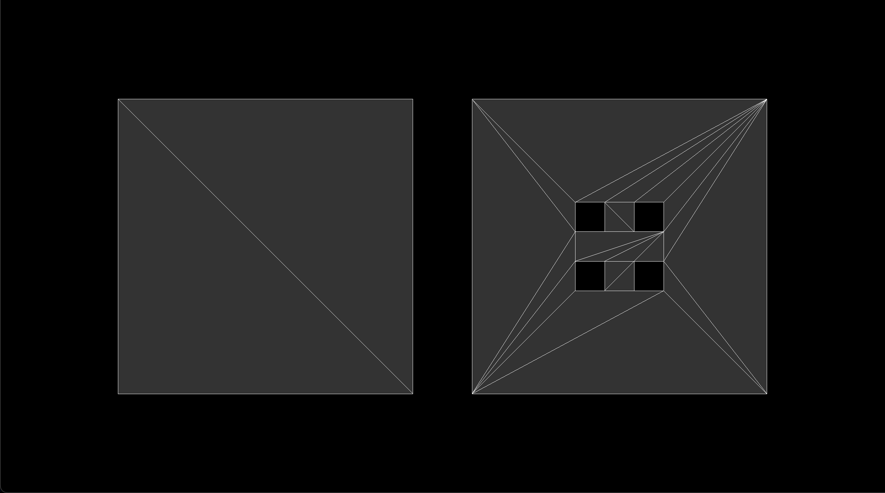

## 概述

[earcut](https://github.com/mapbox/earcut) 是一个极小且极快的三角剖分库，它可以剖分二维图形、三维图形、无孔图形、有孔图形。

<br />

## 示例



本项目使用 `three.js` 来可视化了 `earcut` 的剖分效果，你可以通过依次执行下述命令来启动一个开发服务器，并查看到上述的剖分结果：

1. `npm install`
2. `npm run start`

> 你可以在 `source/index.js` 中找到所有源代码。
>

<br />

## 用法

剖分二维无孔图形：

```javascript
const positions = [ 0,0, 1,0, 1,1, 0,1 ];

earcut( positions, undefined, 2 ); // return [ 2, 3, 0, 0, 1, 2 ]
```

剖分三维无孔图形：

```javascript
const positions = [ 0,0,0, 1,0,0, 1,1,0, 0,1,0 ];

earcut( positions, undefined, 3 ); // return [ 2, 3, 0, 0, 1, 2 ]
```

剖分二维有孔图形：

```javascript
const positions = [
    0,0, 6,0, 6,3, 0,3, // 轮廓的顶点，建议按逆时针顺序来提供
    1,1, 1,2, 2,2, 2,1, // 孔1的顶点，建议按顺时针顺序来提供
    4,1, 4,2, 5,2, 5,1, // 孔2的顶点，建议按顺时针顺序来提供
];
const holes = [ 4, 8 ]; // 表示4~7号顶点为孔1，8~11号顶点为孔2

earcut( positions, holes, 2 ); // return [ 7, 8, 9, 11, 4, 0, 3, 0, 4, 6, 7, 9, 11, 0, 1, 3, 4, 5, 10, 11, 1, 2, 3, 5, 10, 1, 2, 2, 5, 6, 9, 10, 2, 2, 6, 9 ]
```

剖分三维有孔图形：

```javascript
const positions = [
    0,0,0,  6,0,0,  6,3,0,  0,3,0, // 轮廓的顶点，建议按逆时针顺序来提供
    1,1,0,  1,2,0,  2,2,0,  2,1,0, // 孔1的顶点，建议按顺时针顺序来提供
    4,1,0,  4,2,0,  5,2,0,  5,1,0, // 孔2的顶点，建议按顺时针顺序来提供
];
const holes = [ 4, 8 ]; // 表示4~7号顶点为孔1，8~11号顶点为孔2

earcut( positions, holes, 3 ); // return [ 7, 8, 9, 11, 4, 0, 3, 0, 4, 6, 7, 9, 11, 0, 1, 3, 4, 5, 10, 11, 1, 2, 3, 5, 10, 1, 2, 2, 5, 6, 9, 10, 2, 2, 6, 9 ]
```

> 关于轮廓和孔的顶点的顺序：我推荐你按逆时针顺序来提供轮廓的顶点，按顺时针的顺序来提供孔的顶点，因为这符合 [GeoJSON 规范](https://datatracker.ietf.org/doc/html/rfc7946) 对 `Polygon` 的定义。不过，哪怕你不遵循这种做法，`earcut` 也能正确的剖分多边形。

<br />

## 剖分失灵

有时候，`earcut` 的剖分结果是一个空数组 `[]`，我把这种情况称之为剖分失灵。而我们只会在剖分三维图形时，才会遇到剖分失灵的情况。

要明白剖分失灵的原因，就必须先阐述清楚 `earcut` 剖分三维图形的原理，其原理为：将三维图形的 XYZ 坐标投影至 XY 平面，然后就可以把三维图形当成二维图形来进行剖分。

如果三维图形的所有顶点都刚好投影在 XY 平面上的一条直线上，那么就会触发剖分失灵。比如下例中的 `positions_2` 的顶点就都被投影到了 X 轴上，然后就出发了剖分失灵。

```javascript
const positions_1 = [ 0,0,0, 1,2,0, 2,0,0 ];
const positions_2 = [ 0,0,0, 1,0,2, 2,0,0 ];

earcut( positions_1, undefined, 3 ); // return [ 1, 0, 2 ]
earcut( positions_2, undefined, 3 ); // return []
```

你可以通过阅读这个 [issue#151](https://github.com/mapbox/earcut/issues/151) 来获得更多信息。

<br />

## GeoJSON

我推荐你阅读 [GeoJSON 规范](https://datatracker.ietf.org/doc/html/rfc7946)，因为它详细阐述了带孔多边形的数据结构，下面总结一些你可能需要的关于 GeoJSON 规范的知识：

- `Polygon` 的 `coordinates` 是一个数组，它拥有零至多个 `linear ring`。其中第一个 `linear ring` 代表多边形的轮廓，其内的顶点以逆时针方向进行排序，剩余的 `linear ring` 都代表多边形的孔，其内的顶点以顺时针方向进行排序。
- `linear ring` 是一个数组，它拥有至少四个 `position`。其中首 `position` 和尾 `position` 必须相同，因为 `linear ring` 是一个封闭的图形。
- `position` 是一个数组，用于存储坐标，比如 `[103, 20]`。

<br />

## 许可

本项目遵循 [MIT](https://github.com/jynxio/simplecode-earcut/blob/main/license) 协议。
