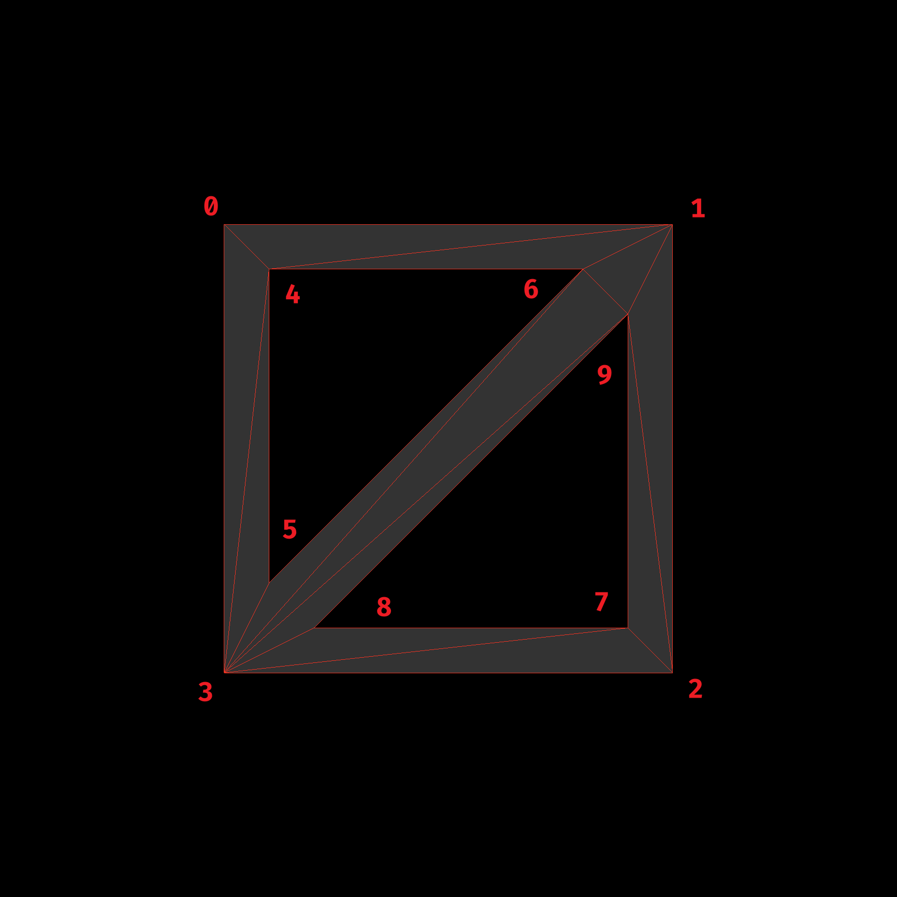

# practice-earcut

```js
const data = [
    - 50, + 50, 0, // boundary 左上角
    - 50, - 50, 0, // boundary 左下角
    + 50, - 50, 0, // boundary 右下角
    + 50, + 50, 0, // boundary 右上角
    - 40, + 40, 0, // 孔1 左上角（三角形）
    + 30, + 40, 0, // 孔1 右上角（三角形）
    - 40, - 30, 0, // 孔1 左下角（三角形）
    + 40, - 40, 0, // 孔2 右下角（三角形）
    - 30, - 40, 0, // 孔2 左下角（三角形）
    + 40, + 30, 0, // 孔2 右上角（三角形）
];

const index = earcut( data, [ 4, 7 ], 3 ); // 0~3号顶点是图形的轮廓，4~6号顶点是孔1的轮廓，7~9号顶点是孔2的轮廓
// index:
// 0, 1, 6
// 5, 6, 1
// 1, 8, 9
// 7, 8, 1
// 0, 6, 4
// 5, 1, 9
// 7, 1, 2
// 3, 0, 4
// 9, 7, 2
// 3, 4, 5
// 9, 2, 3
// 3, 5, 9
```

